**Speaking Clock ovvero “*l'orologio «parlante»”***

***(Parte prima: l'hardware)***

Visitando per vari motivi "case per anziani" ci siamo resi conto di una serie di piccole (*ma non così piccole per l'anziano che le subisce*) problematiche legate alle "*difficoltà di lettura*" ed all'avanzare della "*demenza senile*".

La sempre maggiore "difficoltà di lettura" rende complicata, se non impossibile, la visione di un orologio posto ad una certa distanza e la corretta interpretazione dell'ora indicata, mentre  l'avanzare della "demenza senile" spesso rende difficile il memorizzare e ricordare alcune cose (*es. il prendere delle medicine ad un certo orario, oppure l'ora del pranzo o della cena e così via*).

Volendo cercare di aiutare queste persone ci siamo messi a progettare un oggetto che potesse aiutare in entrambe le problematiche e, da questo, è nato "l'orologio parlante" **con messaggistica programmabile**.

Il prodotto inizialmente è nato per trovare una soluzione alle problematiche sopra descritte, ma, una volta realizzata una prima versione (*adatta agli ambienti ospedalieri e case di cura che, come vedremo, è basata su un ATSAMD21*), ci si è resi conto delle potenzialità e dei possibili usi in tutt'altri ambienti e con tutt'altri scopi. Difatti, la possibilità di programmare messaggi di vari tipo (*files audio MP3*) ed associarli a giorni diversi, ad orari diversi ed a condizioni diverse, ci ha portato a pensarne un utilizzo molto più diffuso come, ad esempio, in ambienti di ufficio (*messaggi sull'orario di entrata, di uscita e delle pause*), nei negozi (*orari di apertura e chiusura diffusi al pubblico ed annuncio di imminente chiusura*), lavoratori in smart-working (*promemoria degli orari e delle pause*), e così via negli ambienti più svariati con le più variegate esigenze. A questo punto abbiamo anche rivisto il progetto hardware facendo una seconda versione, completamente compatibile con la prima, ma che permettesse sia l'uso della MCU originale, sia l'uso di MCU basata su ESP32 con possibilità di connessione Wi-Fi per sempificare la configurazione e l'invio di comandi (*oltre alla possibilità originale via porta seriale*).

Di seguito descriveremo quindi sia l'hardware originale da cui siamo partiti, sia la sua successiva evoluzione.

Tutto il sistema si basa su tre moduli fondamentali:

- un modulo RTC basato su DS3231 (*di quelli che hanno a bordo anche la EEPROM AT24C32*) che offre la garanzia di una notevole precisione: (Img\_01.jpg)

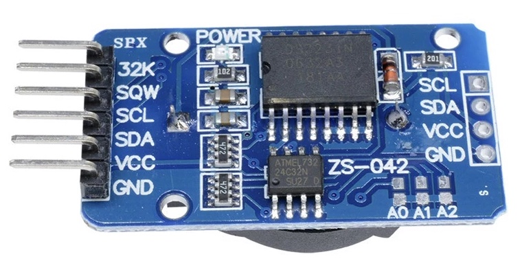

- un modulo riproduttore di MP3 basato su JQ8400 con memorizzazione dei files audio su flash esterna (*e non su SD*):

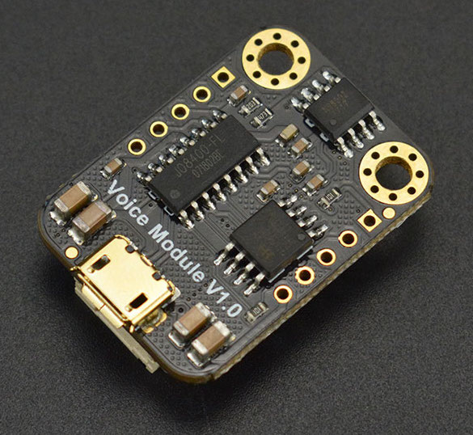

- un modulo MCU, dalle dimensioni estremamente contenute, prodotto da SeeedStudio, basato su ATSAMD21 e facente parte della famiglia dei moduli XIAO:

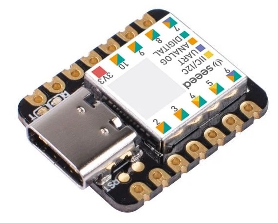

Tutti questi moduli hanno il vantaggio di lavorare a 3.3V rendendo semplice la loro interconnessione.

Particolare attenzione è stata poi posta nella scelta del display da utilizzare per la visualizzazione dell'ora, scelta che è caduta su un modulo prodotto da Adafruit (*Product ID: 1269*) in cui i vari *digit*, di colore giallo (*colore molto visibile*), sono alti ben 3 cm (1.2") permettendone una chiara visione anche ha chi ha la vista più debole:

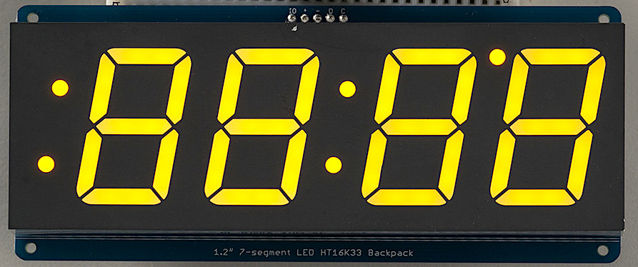

Il suddetto modulo ha il vantaggio di colloquiare in I2C, occupando così solo 2 pin della MCU, pin che sono utilizzati anche per il colloquio con il modulo RTC.

Anche se Adafruit indica questo modulo come da alimentare a 5V, ma controllabile da una MCU a 3.3V (*difatti ha il pin dell'alimentazione separato dal pin che porta il positivo sulle resistenze di pull-up incorporate sul bus I2C*) la cosa non è sempre vera (*il chip di controllo che è montato su tale display richiede almeno 3.5V e ... a volte, grazie alle tolleranze, può capitare di trovare il display che accetta sul bus I2C i 3.3V, ma, da prove effettuate su vari campioni, la maggior parte non è così tollerante e non funziona*). Per garantire in ogni caso il funzionamento, si è deciso di utilizzare un modulo traslatore di livelli adatto al bus I2C come il seguente, prodotto sempre da Adafruit (*Product ID: 757*):

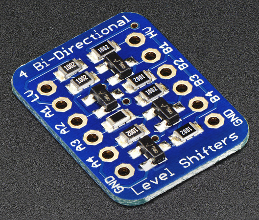

Tali traslatori di livello si trovano, a costi decisamente inferiori, anche di produzione cinese, ma occorre prestare particolare attenzione alla disposizione dei pin che è leggermente diversa (*i pin di alimentazione, normalmente sui lati, sono posto al centro invece che agli estremi*):

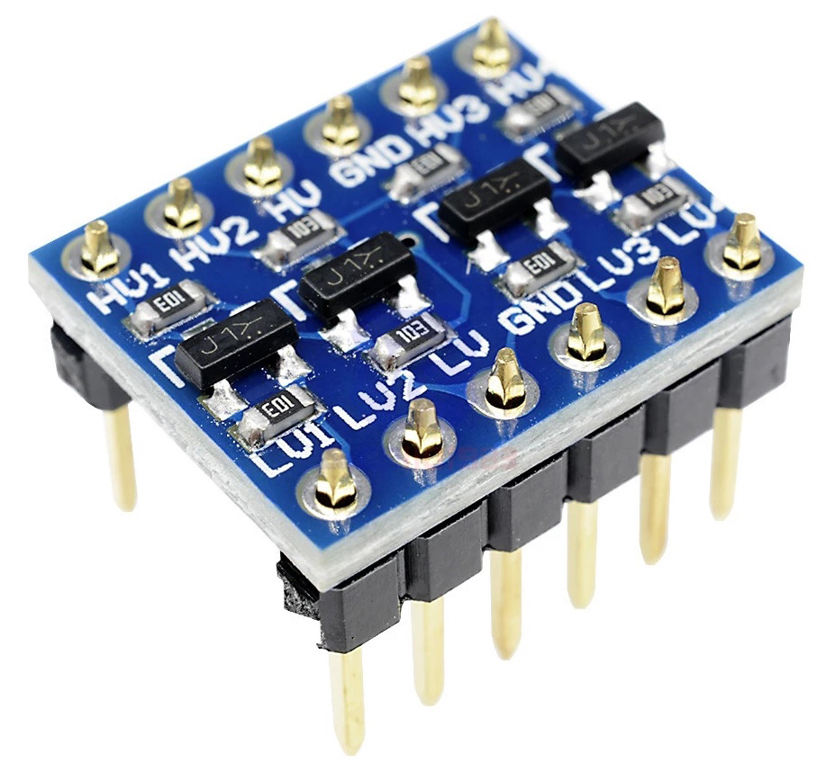

Come sarà illustrato più avanti, nel disegno del circuito stampato, si è tenuto conto di questa cosa e sono state predisposte più serie di fori per poter così montare sia i moduli originali di Adafruit, sia i loro cloni cinesi con i pin di alimentazione in posizione diversa.

Dato che sia il display, che specialmente il modulo vocale, assorbono parecchia corrente (*il modulo vocale, durante la riproduzione, con lo speaker collegato, arriva ad assorbire anche 1A*) si è deciso di prevedere un ingresso in corrente continua da 7V a 15V (*in realtà il regolatore utilizzato accetta da 6.5V a 36V, ma, per sicurezza, è meglio restringere l'intervallo*) con il classico jack da 2.1 mm e di montare a valle un regolatore switching della "Traco Power", modello TSR2-2450 (*N. Mouser: 495-TSR2-2450*)
, in grado di fornire in uscita 5V regolati con una corrente sino a 2A.

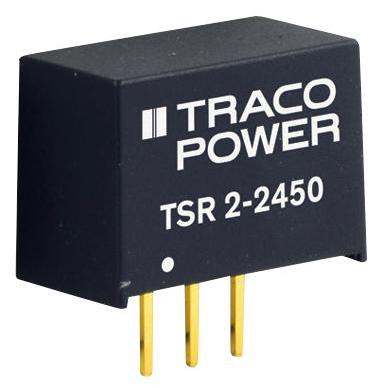

I 5V forniti in uscita da detto modulo sono utilizzati per alimentare il display, la parte HV del traslatore di livello ed il modulo MCU che, a sua volta, fornisce in uscita i 3.3V utilizzati per la parte LV del traslatore di livello e per l'alimentazione del modulo RTC.

Discorso a parte va fatto per il modulo riproduttore di MP3 basato su JQ8400; tale integrato, come visibile dal suo datasheet, accetta un'alimentazione da 3.3V a 5.5V, ma il miglior funzionamento è garantito attorno ai 4.2V, per cui, per avvicinarsi il più possibile a tale valore ottimale, si è messo in serie al pin di alimentazione, un diodo al silicio SB240 che provoca una caduta di tensione di circa 0.7V e che permette di abbassare i 5V forniti dal regolatore switching ai circa 4.2V ottimali. Altra particolarità di detto integrato è che ha i pin di I/O seriali (*TX ed RX*) che lavorano invece a 3.3V e che quindi sono direttamente collegabili alla UART della MCU.

Tutto ciò premesso possiamo esaminare la **prima versione** (*più avanti descriveremo un'evoluzione che permette l'utilizzo di due MCU differenti, selezionabili in funzione delle proprie esigenze e dell'ambiente in cui dovrà essere installato il prodotto finito* ) del circuito elettronico del nostro progetto:

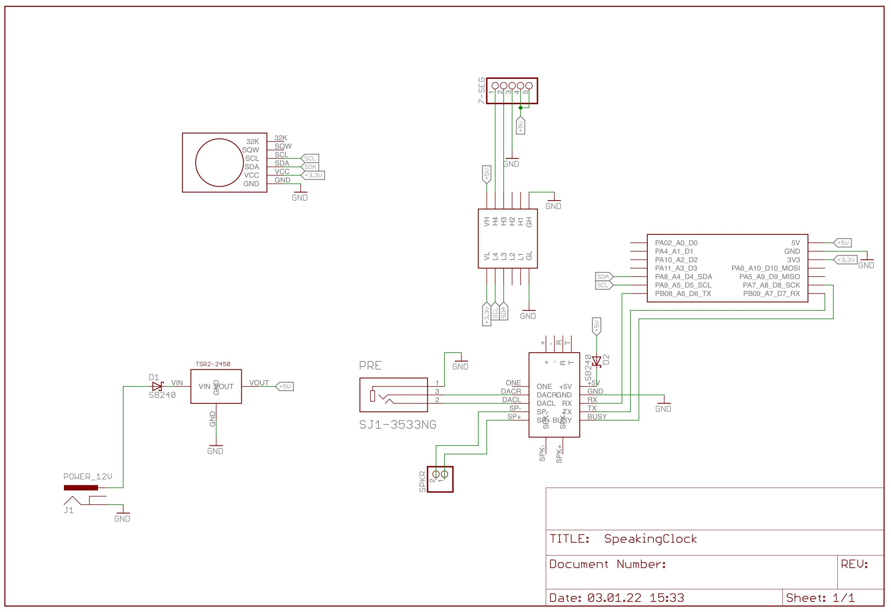

Oltre alle parti già descritte in precedenza, in più troviamo un secondo diodo, a protezione delle inversioni di polarità, in serie all'alimentazione generale (*subito dopo il jack da 2.1mm*) , un connettore JST da 2 mm utilizzato per collegare direttamente un altoparlante, da 8Ω 3W, al JQ8400 ed un jack femmina stereo per il collegamento dell'uscita preamplificata del JQ8400 ad un amplificatore esterno (*o ad una coppia di casse amplificate come quelle che di collegano all'uscita audio dei PC tramite jack stereo da 3.5mm*). Per il disegno del circuito e per la successiva realizzazione dello stampato, si è utilizzato il prodotto software "Eagle" nella versione 7.7, ultima realizzata ancora da Cadsoft prima dell'acquisizione da parte di Autodesk. Dato che alcune parti non erano disponibili (*es. il modulo audio, il modulo RTC, il modulo XIAO, ecc. ecc.*), esse sono state disegnate e sono fornite in forma di libreria Eagle (.lbr) tra i files scaricabili relativi a questo progetto.

Il circuito stampato, relativo allo schema illustrato sopra, è stato realizzato in modo da poter essere direttamente attaccato dietro al display così da formare un *sandwich* unico. Le sue misure sono 50.8 mm di altezza per 119.5 mm di lunghezza e, sia il modulo audio, che il modulo di MCU, sono posizionati in modo da rendere facilmente disponibile l'accesso alle relative porte USB necessarie sia per il caricamento/aggiornamento del firmware sulla MCU che per il caricamento/aggiornamento dei file audio  sul modulo con il JQ8400. La porta USB sulla MCU è anche utilizzata, come porta seriale, nella fase di inizializzazione dell'orologio o durante la modifica, in funzione delle proprie necessità, di alcuni suo parametri di funzionamento.

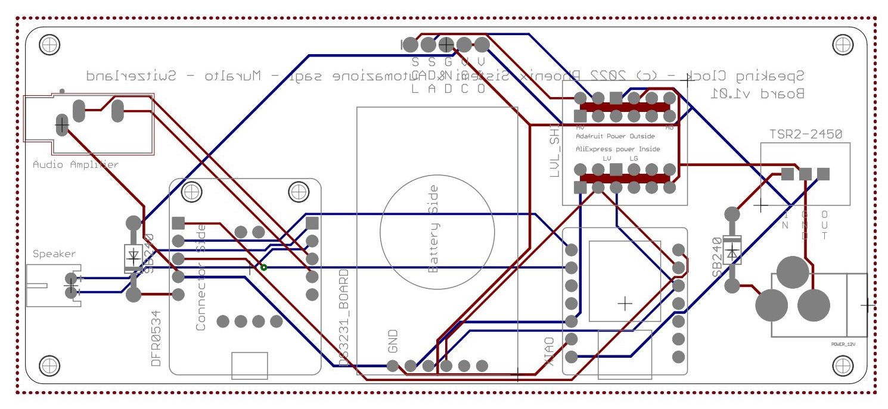

A questa versione dell'hardware è succeduta una nuova versione, basata su un modulo MCU con ESP32, utilizzabile in tutti quegli ambienti dove avere un Wi-Fi attivo non crea alcun problema (*sia sotto il profilo ambientalistico di emissione di onde elettromagnetiche, sia sotto il profilo "sanitario" per cui, in alcuni ambienti, causa dei disturbi che può indurre su particolari strumenti, non è permesso avere moduli Wi-Fi in funzione*).

La nuova versione del circuito va vista come un ampliamento della precedente è lascia libera scelta all'utente se montare il modulo con ATSAMD21 (*e quindi senza Wi-Fi*) o il modulo con ESP32 (*e quindi con Wi-Fi da cui fornire i comandi all'orologio*). Ovviamente lo stampato prevede entrambi, ma, praticamente, è possibile montare solo uno dei due nel relativo alloggiamento.

Per contenere al massimo l'ingombro e poter utilizzare uno stampato di dimensioni identiche a quello della versione per solo ATSAMD21, si è scelto il modulo ESP32 della WeMos D1 mini dalle dimensioni estremamente contenute:

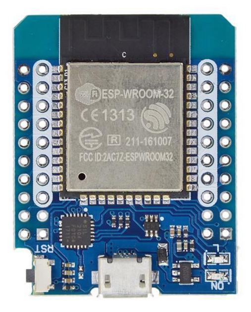

Si è quindi adattato lo schema elettrico in modo da poter prevedere entrambe le MCU e lasciare libera scelta all'utente su quale utilizzare. Il resto dello schema, salvo l'aggiunta del modulo con ESP32, è rimasto invariato rispetto alla versione precedente:

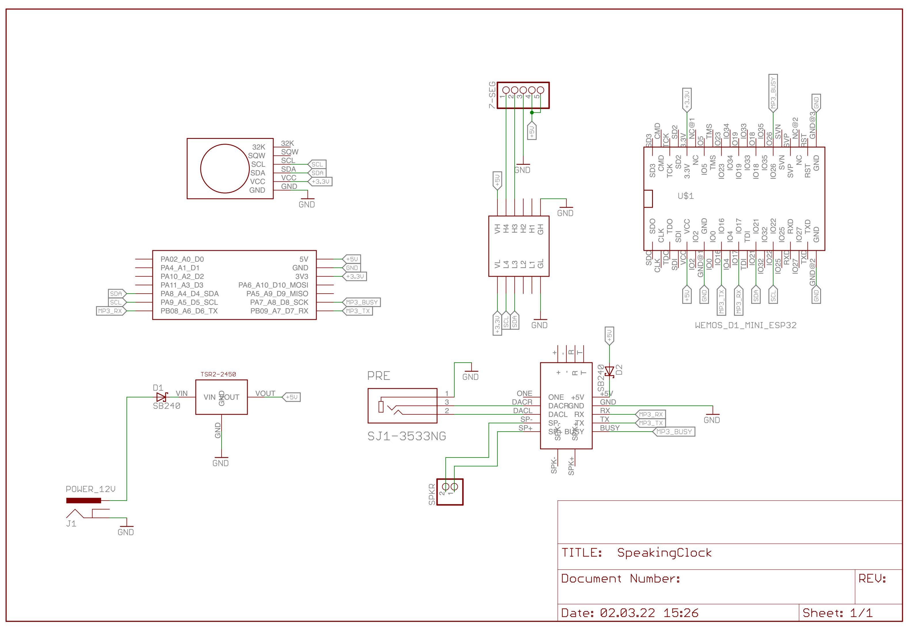

Come detto, si è fatto in modo che anche le dimensioni dello stampato rimanessero le stesse e fosse sempre possibile montarlo a sandwich sul retro del display, ottenendo un modulo compatto e con i connettori USB sempre accessibili per aggiornamenti e personalizzazioni (*vedremo nella parte dedicata al software che, salvo una serie di messaggi MP3 riservati per il funzionamento del sistema, è comunque possibile personalizzare il tutto con l'aggiunta di propri files audio*).

Lo stampato risultante (*di cui i files gerber sono liberamente scaricabili*) è quindi il seguente:

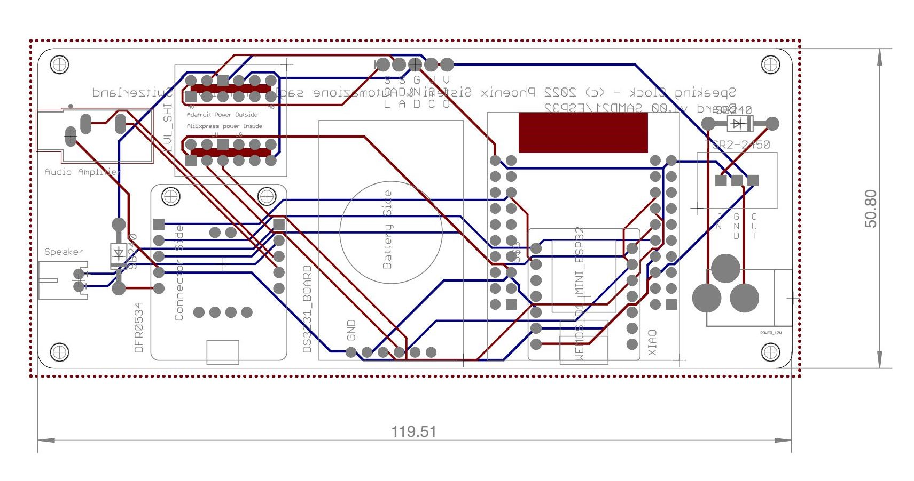

Si osservino le seguenti particolarità:

1. in alto a sinistra, la doppia fila di fori per l'inserimento di due tipi di traslatori di livello, sia quello originale prodotto da Adafruit, con le alimentazioni agli estremi, sia i compatibili cinesi, con le alimentazioni al centro.

2. in basso, verso destra, più file di fori per poter inserire o il modulo MCU XIAO con ATSAMD21 di SeeedStudio o il modulo MCU WeMOS ESP32 D1 mini (*ovviamente, o uno o l'altro*).

Verso il centro dello stampato trova posto il classico modulo RTC, basato su DS3231, con l'alloggiamento della batteria rivolto verso l'alto (*così da permetterne sempre la sostituzione*), mentre in basso a sinistra trova spazio il modulo vocale MP3 basato su chip JQ8400. Sempre a sinistra, a fianco di tale modulo, si trova sia il connettore JST da 2mm per il collegamento diretto di un altoparlante da 8Ω 3W, sia il connettore audio stereo per jack da 3.5 mm dove collegare delle casse amplificate per avere un audio più potente. Sulla destra si trova infine il classico jack nero da 2.1 mm che permette l'alimentazione del tutto con un alimentatore esterno da 7v a 12V.

Si conclude così la parte dedicata all'hardware del nostro progetto; nella seconda parte ci dedicheremo invece alla parte software.