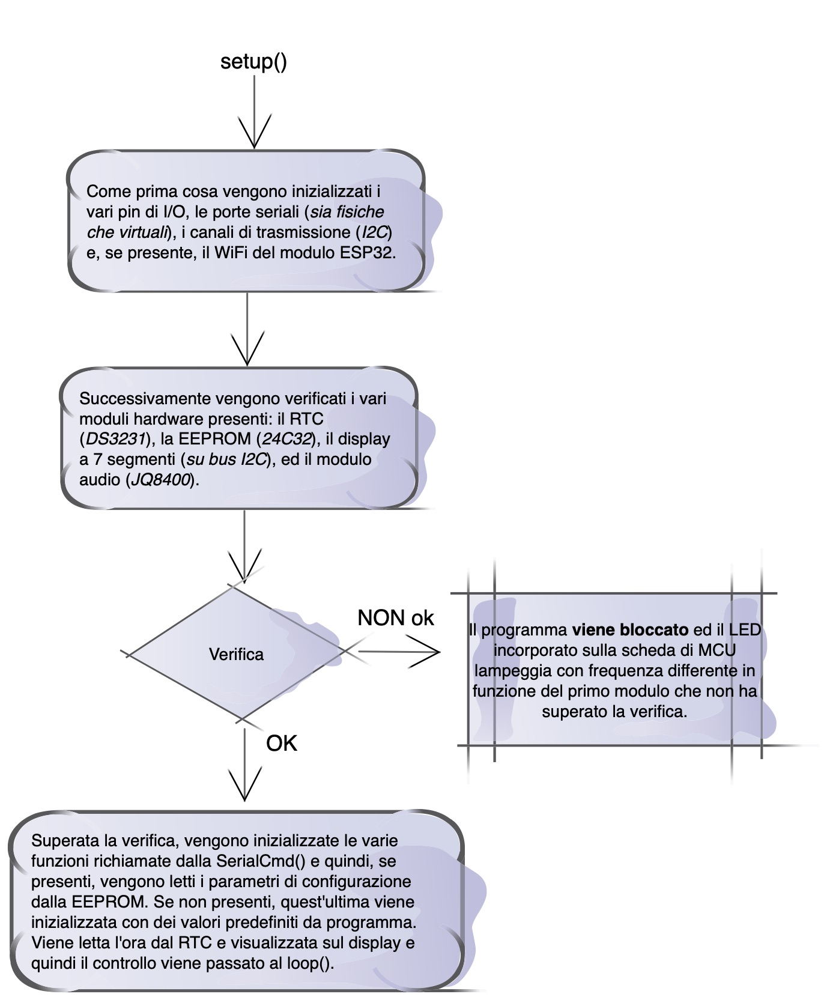
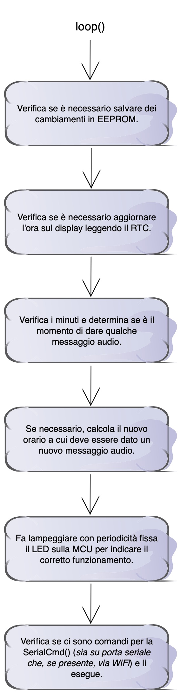

**Speaking Clock ovvero “*l'orologio «parlante»”***

***(Parte seconda: il software)***

Nella prima parte abbiamo descritto le varie componenti hardware su cui si basa il progetto, in questa seconda parte passiamo invece ad esaminare il software che permette il suo funzionamento e la sua programmazione (*Suggerimento: tenere aperto il sorgente del programma e leggere questa parte seguendo il codice*).

Come anticipato nella parte relativa all'hardware, il progetto si è con il tempo evoluto ed oggi permette l'utilizzo sia di una MCU basata su ATSAMD21 che si una basata su ESP-WROOM-32. A livello di codice, per compilare, selezionata nell'IDE di Arduino la giusta MCU, non occorre fare altro; una serie di #define inserite in vari punti del programma, provvedono a riconoscere se si sta compilando per ATSAMD21 (*viene verificata la presenza della definizione ARDUINO\_SEEED\_XIAO\_M0*) o per ESP32 (*viene verificata la presenza della definizione ESP\_PLATFORM*) ed ad abilitare o disabilitare intere parti di codice.

La sola linea di programma che ha senso modificare a mano e quella per abilitare tutta la messaggistica di "DEBUG" che, se attiva, viene inviata sulla porta seriale (USB) della MCU. Tale riga è ad inizio programma ed è normalmente commentata:

    // #define DEBUG // uncomment this line ONLY for debug

Nel corso del programma viene verificata la presenza o meno della definizione "DEBUG" e, di conseguenza, attivata o meno la messaggistica di diagnostica. Normalmente, salvo non si facciano modifiche e non si voglia verificare il corretto funzionamento del programma, tale costante NON deve essere definita ovvero la riga va lasciata con il commento davanti.

Sempre in testa al programma troviamo una serie di definizioni relative ad alcune costanti utilizzate all'interno del codice tra cui il livello logico con cui il LED incorporato sulla scheda della MCU si accende, il numero di alcuni pin ed l'indirizzo I2C dei moduli utilizzati. A seguire c'è una serie di #include che includono le varie librerie utilizzate, alcune standard del 'C', altre proprie di Arduino, altre specifiche per la gestione dei moduli hardware utilizzati ed altre generiche. Alcune di esse sono state parzialmente modificate o corrette e **DEVONO** essere necessariamente scaricate ed installate per avere la giusta versione. L'utilizzo di quelle normalmente reperibili su GitHub, fornite dagli autori, compromette il funzionamento dell'applicazione e quindi è da evitare (*ad esempio, la libreria "JQ8400\_Serial" originale contiene un metodo, ampiamente usato all'interno della nostra applicazione, che, nella sua versione originale contiene un baco e non funziona*).

Terminate le varie definizioni costanti, prima di permettere la compilazione vera e propria, il programma esegue una serie di verifiche sui valori definiti all'interno di librerie/include esterni e, se qualche valore non è conforme alle aspettative, la compilazione viene bloccata.

Se le verifiche sono soddisfatte, si passa alla parte di dichiarazione delle variabili globali, degli "enums", delle strutture ed ad istanziare le varie classi.

Dopo tale parte, nel codice troviamo prima di tutto una serie di funzioni di utilità, come ad esempio le funzioni per il salvataggio ed il recupero dei parametri iniziali dalla EEPROM, le funzioni per la lettura e scrittura del RTC DS3231, le funzioni per il calcolo dell'ora legale (*se utilizzata*), ecc. ecc., funzioni che sono poi richiamate a livello degli immancabili (*essendo un programma sviluppato in ambiente IDE Arduino*) setup() e loop().

Finita la serie di funzioni di utilità inizia tutta una serie di callback ad uso della libreria **SerialCmd**, libreria installabile dall'IDE di Arduino ed ampiamente utilizzata nel nostro programma per interpretare tutti i possibili comandi che si possono fornire sia via porta seriale (*collegamento USB*) che, nel caso di utilizzo di ESP32, anche via WiFi. L'elenco di tutti i comandi disponibili con la versione **1.2.1** del programma è riassunto di seguito e sono anche dettagliati i parametri che ciascun comando si attende e cosa viene fatto quando viene ricevuto:

**● SETDT,YY,MM,GG,HH,MN,SS,DW** *Set date/time* 
YY : Year (0 .. 99) MM : Month (1 .. 12) GG : Day (1 .. 31) HH : Hours (0 .. 23) MN : Minutes (0 .. 59) SS : Seconds (0 .. 59) DW : Day of Week (1 .. 7, 1 = Domenica)  N.B.: si **DEVE** sempre impostare l'"*ora solare*" e mai l'"*ora legale*", anche quando essa è attiva. Ciò significa che durante l'"*ora legale*" è necessario fornire la data e l'ora come se fosse in vigore l'"*ora solare*". L'orologio si corregge da solo e visualizza l'ora corretta. 

**● GETDT** *Get (print) date/time in the same format of SETDT (valid only from serial port)* 
 **● SETUD,DS** *Set use DST* DS : 1 = usa DST, 0 = Non usa DST (*DST: utilizzo dell'ora legale*) 
 **● SETDB,DS,DN** *Set display brightness* DS : luminosità del display durante il giorno (0 .. 15) DN : luminosità del display durante la notte (0 .. 15)  
**● SETPA,MN** *Set period of announcements* MN : gli annunci possono avere solo periodicità di: **10**, **15**, **30** o **60** minuti 
 **● SETON,HH,MN** *Set audio ON time for announcements* HH : Hours (0 .. 23) MN : Minutes (0 .. 59) 
 **● SETOF,HH,MN** *Set audio OFF time for announcements* HH : Hours (0 .. 23) MN : Minutes (0 .. 59) 
 **● SETAM,MN,VD,HO,MO,HF,MF,M1,M2,... up to max of (MAX\_USR\_LNG - 1) messages** *Set User defined announcement (played after the standard announcement)* MN : Message Number (0 .. MAX\_USR\_MSG - 1) VD : Valid days (0 = all, 1 .. 254 days selection, see note 1) HO : Hours Start (0 .. 23) MO : Minutes Start (0 .. 59) HF : Hours Stop (0 .. 23) MF : Minutes Stop (0 .. 59) Mn : Audio message number (ZH/nn.MP3), can be repeated max (MAX\_USR\_LNG - 1) times< **note 1**: VD è un campo binario, i bit validi vanno dal bit 1 al bit 7, il bit zero è riservato. Perindicare i giorni validi sommare il valore decimale di ciascun bit. Quindi, Dom = 2, Lun  = 4, Mar 8, Mer = 16, Gio = 32, Ven = 64, Sab = 128. Ad esempio, per essere valido solo per Lun, Mer e Ven si deve sommare 4 + 16 + 64 = 84, che è il valore da inserire nel campo VD. **Esempio**: SETAM, 0, 0, 10, 30, 12, 7, 70, 12, 0 - Programma il messaggio personalizzato numero 0, valido tutti i giorni (0), dalle ore 10, minuti 30, alle ore 12, minuti 5, file 70.mp3, file 12.mp3, 0 finale (*non obbligatorio, rende solo più chiaro*). 
 **● CLRAM,MN** *Clear User defined announcement (played after the standard announcement)* MN : Message Number (0 .. MAX\_USR\_MSG) 
 **● GETPM** *Get (print) all parameters (valid only from serial port)* 
 **● SETOD,WD** *Set audio off week day* WD : da 0 a 7 (1 = Domenica, 2 = Lunedì, .. 7 = Sabato, 0 = tutti i giorni) 
 **● SETAV,VL** *Set audio volume* VL : da 0 a 30 
 **● SETDY,UD** *Set adds the date in the time announcement* UD : 1 = adds, 0 = Don't adds **Nota**: Se il parametro UD è messo ad 1, dopo l'annuncio dell'ora (*solo ogni ora esatta*), viene anche indicata la data 
 **● RESET** *Do a software reset of the MCU and restart the program* 

Nel sorgente, ogni callback relativa alla "SerialCmd" ha un commento che indica a quale comando essa è associata (*l'associazione vera tra comando e callback viene fatta nel setup()*).

Finita tutta la serie di callback si raggiunge finalmente la funzione setup() e quindi la funzione loop(). Rammentiamo che il "*core*" Arduino, per semplicità, nasconde all'utilizzatore la funzione principale di ogni programma C/C++, ovvero la funzione main(), ma che in realtà tale funzione esiste ed è lei che richiama una sola volta la funzione setup() e poi, in un ciclo infinito (*quindi in continuazione*), chiama la funzione loop().  

Quanto viene svolto nel **setup()** è illustrato nel seguente diagramma:

Vengono prima di tutto inizializzati i vari pin di I/O, le porte seriali (*sia fisiche che eventuali porte virtuali*), i vari bus (*in particolare il bus I2C*) e, solo se si sta compilando per ESP32, il modulo WiFi di detta MCU.

Di seguito vengono verificati i vari moduli hardware presenti nel circuito, controllando la loro risposta o sul bus I2C (*per la EEPROM, il modulo RTC ed il display a 7 segmenti*), o sulla porta seriale (*per il modulo audio basato su JQ8400*). Se la verifica ha successo, il programma prosegue, altrimenti, se uno dei moduli hardware fallisce la verifica, il programma viene arrestato ed il LED presente a bordo della scheda di MCU viene fatto lampeggiare con frequenza differente in funzione del primo modulo non funzionante incontrato secondo la seguente tabella:

|*Componente incriminato*|*Semiperiodo di lampeggio del LED*|
| :-: | :-: |
|DS3231 RTC|250 ms|
|24C32 EEPROM|125 ms|
|Display 7 segmenti I2C|62 ms|
|Modulo Audio con JQ8400|30 ms|

 Se la verifica viene superata allora si procede con l'assegnazione dei vari comandi alle varie callback della "SerialCmd" …

    ...
    mySerCmd.AddCmd ( "SETDT" , SERIALCMD_FROMALL, set_DTTM );
    mySerCmd.AddCmd ( "GETDT" , SERIALCMD_FROMSERIAL, get_DTTM );
    mySerCmd.AddCmd ( "SETUD" , SERIALCMD_FROMALL, set_UDST );
    mySerCmd.AddCmd ( "SETDB" , SERIALCMD_FROMALL, set_DIBT );
    mySerCmd.AddCmd ( "SETPA" , SERIALCMD_FROMALL, set_PERA );
    mySerCmd.AddCmd ( "SETON" , SERIALCMD_FROMALL, set_TMON );
    mySerCmd.AddCmd ( "SETOF" , SERIALCMD_FROMALL, set_TMOF );
    mySerCmd.AddCmd ( "SETOD" , SERIALCMD_FROMALL, set_ODAY );
    mySerCmd.AddCmd ( "SETAV" , SERIALCMD_FROMALL, set_AVOL );
    mySerCmd.AddCmd ( "SETDY" , SERIALCMD_FROMALL, set_UDAY );
    mySerCmd.AddCmd ( "SETAM" , SERIALCMD_FROMALL, set_AMSG );
    mySerCmd.AddCmd ( "CLRAM" , SERIALCMD_FROMALL, clr_AMSG );
    mySerCmd.AddCmd ( "GETPM" , SERIALCMD_FROMSERIAL, get_PARM );
    mySerCmd.AddCmd ( "RESET" , SERIALCMD_FROMALL, do_RESET );
    ...

… proseguendo poi con la lettura dei dati presenti in EEPROM (*se presenti, altrimenti vengono utilizzati dei valori di default*), con quelli presenti nel RTC e con l'attivazione del display per la visualizzazione dell'ora.

Le informazioni salvate in EEPROM (*ed eventualmente memorizzate con valori di default la prima volta*) sono descritte nella struttura 'C' "**params**". I vari elementi hanno nomi descrittivi ed il commento, associato ad ogni singola riga, ne permette facilmente la comprensione. Unico elemento degno di nota è il primo, "char blockID[7]". Esso serve ad indentificare la corretta inizializzazione della EEPROM e la versione della sua struttura (*il contenuto è uguale a quello dalla costante BLOCK\_ID*). Per maggiore sicurezza, su tutto il blocco dei parametri è calcolato un **CRC32**, ed il valore è salvato, sempre in EEPROM, subito dopo il blocco dei parametri. Ogni volta che il suddetto blocco viene letto, viene ricalcolato il CRC32 e confrontato con il valore memorizzato. Se i due valori non corrispondono si considera  il contenuto non valido e la EEPROM viene reinizializzata con i valori di *default*. Per completezza riportiamo il contenuto del blocco "params" (*relativo alla versione **1.2.1** del programma*):

    struct params {
      char     blockID [7];                // block_id to identify valid params
      bool     use_DST;                    // automatically adjust the clock following DST
      uint8_t  display_bright;             // display brightness during day (0 .. 15)
      uint8_t  display_bright_night;       // display brightness in the night (0 .. 15)
      uint8_t  audio_period;               // period of audio announcements (10/15/30/60)
      uint32_t audio_on;                   // audio-on time and day brightness display
      uint32_t audio_off;                  // audio-off time and night brightness display
      uint8_t  audio_off_day;              // audio off day (0 = none, 1 Sun .. 7 Sat)
      uint8_t  audio_volume;               // audio volume (0 .. 30)
      bool     audio_add_day;              // adds the date in the time announcements
      message  user_msgs[MAX_USR_MSG];     // Array of custom user message list
    } clock_params;

… mentre la funzione che calcola il CRC32 si trova nei due files (*che vengono inclusi ad inizio programma*) di nome "crc32.h" e "crc32.c" e che si trovano nella stessa cartella del programma principale (*phxSpeakingClock*).

Terminata la funzione di setup(), ricordiamo che il controllo torna al main() (*che, come detto, è nascosto nel "core" Arduino*) il quale, all'interno di un ciclo FOR infinito, chiama la funzione loop() dalla quale, quindi, si entra e si esce in continuazione (*cosa da tenere sempre a mente perché, eventuali variabili locali dichiarate dentro la funzione loop(), se non dichiarate di tipo "static", vengono ogni volta create ad inizio funzione e distrutte al momento della sua fine, con conseguente pedita del valore tra una chiamata al loop() e la successiva*).

Quanto svolto ad ogni chiamata della funzione **loop()** è illustrato nel diagramma che segue:

In detta funzione tutte le varie operazioni vengono programmate facendo uso della funzione millis() nella classica forma …

    if ( millis() - ultimoMillis >= tempoPrevisto ) {
      // … esegue quello che deve fare
      // ...
      ultimoMillis += tempoPrevisto;
    }

… ad eccezione del controllo relativo alla scrittura su EEPROM che segue una logica leggermente diversa.

Tale controllo è il primo che viene effettuato; per evitare una continua scrittura sulla EEPROM ad ogni cambiamento di un singolo parametro (*ricordiamo che la vita di una EEPROM prevede, per quanto alto, comunque un numero limitato di scritture*), si è scelta la strada di memorizzare il valore di millis() al momento della modifica di uno qualsiasi dei parametri e di effettuare la scrittura fisica solo dopo il passare di EEPROM\_W\_TIME (*valore fissato con una #define*) millisecondi dall'ultima modifica. Unico accorgimento, viene riservato il valore di millis() pari a zero (*che indica nulla da salvare*), per cui, se una qualsiasi modifica avviene proprio nell'istante in cui millis() vale zero, viene memorizzato il valore subito successivo, ovvero 1.

In pratica la parte di codice che effettua il salvataggio dei parametri in EEPROM ha, all'incirca, questa forma:

    if ( EEP_millis != 0 ) {
      if ( millis() - EEP_millis > EEPROM_W_TIME ) {
         EEP_millis = 0;
         save_params();
      }
    }

Dopo il controllo relativo alla scrittura su EEPROM, ci sono una serie di altri compiti che vengono svolti ad intervalli prefissati:

1. se è tempo di leggere l'ora esatta dal RTC e visualizzarla sul display (*questo viene fatto ogni 15 secondi anche perché il display visualizza solo ore e minuti quindi un aggiornamento al secondo sarebbe del tutto inutile*).
2. se è il minuto in cui è necessario dare qualche annuncio (*rammentiamo che si può programmare la periodicità degli annunci con intervallo di 10, 15 30 e 60 minuti*).
3. dopo un annuncio, calcolare il nuovo "minuto" a cui dovrà essere dato il prossimo annuncio.
4. accendere o spegnere (*far lampeggiare*) il LED che si trova sulla scheda della MCU per indicare che comunque il tutto sta lavorando e che il programma non si è bloccato.
5. verificare se ci sono dei comandi in arrivo da porta seriale (USB) e/o, nel caso di moduli ESP32, in arrivo da WiFi ed eseguire i comandi ricevuti.
6. solo se ci si trova su piattaforma ATSAMD21, segnalare al watchdog che il programma sta regolarmente girando e che non è necessario il suo intervento. Su piattaforma ESP32 il watchdog è direttamente gestito dal firmware del modulo.

Svolti tutti i vari punti il loop() giunge al termine e, richiamato immediatamente dopo dal main(), ricomincia da capo.

Esaminata la logica del programma, dedichiamoci a capire il funzionamento della "*messaggistica vocale*". Come detto, il compito di riprodurre i messaggi vocali è demandato ad un modulo basato su **JQ8400** con i vari messaggi vocali memorizzati in una memoria non volatile (*NON su SD, ma su un chip di memoria*). Il JQ8400 ha la particolarità di poter riprodurre sia singoli files audio, sia, cosa da noi sfruttata, sequenze di files audio concatenati l'un l'altro, quindi, ad esempio, per indicare che sono le 10:30, verranno concatenati una serie di tre files audio (files .mp3) contenenti:

- sono le ore
- dieci
- e trenta

ovvero tre files separati che risulteranno in un unico audio riproducente la frase "*sono le ore 10 e trenta*".

**ATTENZIONE**: per come è stato realizzato dal produttore il firmware del JQ8400, i files audio che si vogliono poter riprodurre, oltre che singolarmente, in forma **concatenata**, **DEVONO** necessariamente risiedere in una cartella, subito sotto la radice principale, con nome fisso "**ZH**" ed i files .mp3 è bene che abbiano come prefisso due caratteri numerici (*da 00.mp3 fino a  99.mp3*).

L'attuale versione del programma (*che, rammentiamo, al momento, è la versione 1.2.1*) si riserva l'uso dei files mp da 00.mp3 a 69.mp, mentre da 70.mp3 a 99.mp3 sono a disposizione dell'utente per eventuali messaggi personalizzati. Quale esempio, i messaggi da 70.mp3 a 77.mp3 vengono forniti già registrati per gli utilizzi più comuni. La seguente tabella riassume il contenuto audio dei files .mp3 che vengono forniti già codificati:

|**Nome**|**Contenuto**|**Nome**|**Contenuto**|**Nome**|**Contenuto**|
| :-: | :-: | :-: | :-: | :-: | :-: |
|00.mp3|Sono le ore|31.mp3|e quaranta|62.mp3|sabato|
|01.mp3|una|32.mp3|e cinquanta|63.mp3|*vd.sotto*|
|02.mp3|due|33.mp3|e quindici|64.mp3|primo|
|03.mp3|tre|34.mp3|e quarantacinque|65.mp3|*riservato*|
|04.mp3|quattro|35.mp3|ventiquattro|66.mp3|*riservato*|
|05.mp3|cinque|36.mp3|venticinque|67.mp3|*riservato*|
|06.mp3|sei|37.mp3|ventisei|68.mp3|*riservato*|
|07.mp3|sette|38.mp3|ventisette|69.mp3|1 sec. silenzio|
|08.mp3|otto|39.mp3|ventotto|70.mp3|*vd.sotto*|
|09.mp3|nove|40.mp4|ventinove|71.mp3|*vd.sotto*|
|10.mp3|dieci|41.mp3|trenta|72.mp3|*vd.sotto*|
|11.mp3|undici|42.mp3|trentuno|73.mp3|*vd.sotto*|
|12.mp3|dodici|43.mp3|gennaio|74.mp3|*vd.sotto*|
|13.mp3|tredici|44.mp3|febbraio|75.mp3|*vd.sotto*|
|14.mp3|quattordici|45.mp3|marzo|76.mp3|*vd.sotto*|
|15.mp3|quindici|46.mp3|aprile|77.mp3|*vd.sotto*|
|16.mp3|sedici|47.mp3|maggio|||
|17.mp3|diciassette|48.mp3|giugno|||
|18.mp3|diciotto|49.mp3|luglio|||
|19.mp3|diciannove|50.mp3|agosto|||
|20.mp3|venti|51.mp3|settembre|||
|21.mp3|ventuno|52.mp3|ottobre|||
|22.mp3|ventidue|53.mp3|novembre|||
|23.mp3|ventitré|54.mp3|dicembre|||
|24.mp3|mezzanotte|55.mp3|di|||
|25.mp3|e un quarto|56.mp3|domenica|||
|26.mp3|e mezza|57.mp3|lunedì|||
|27.mp3|e tre quarti|58.mp3|martedì|||
|28.mp3|e dieci|59.mp3|mercoledì|||
|29.mp3|e venti|60.mp3|giovedì|||
|30.mp3|e trenta|61.mp3|venerdì|||

 

|**Nome**|**Contenuto**|
| :-: | :-: |
|63.mp3|controllo iniziale completato con successo,  l'orologio viene avviato|
| - | - |
|70.mp3|il pranzo è alle ore|
|71.mp3|la cena è alle ore|
|72.mp3|ricordarsi di prendere le medicine alle ore|
|73.mp3|il negozio apre alle ore|
|74.mp3|il negozio chiude alle ore|
|75.mp3|l'ufficio apre alle ore|
|76.mp3|l'ufficio chiude alle ore|
|77.mp3|e riapre alle ore|

Visti tutti i vari messaggi che sono a disposizione, è ora più facile comprendere il senso del messaggio personalizzato che abbiamo riportato precedentemente quale esempio, nel comando SETAM. Se ben si ricorda avevamo fatto l'esempio di un messaggio del tipo:

SETAM, 0, 0, 10, 30, 12, 7, 70, 12, 0 ovvero la programmazione del messaggio personalizzato numero 0, valido tutti i giorni (0), dalle ore 10, minuti 30, alle ore 12, minuti 5, file 70(.mp3), file 12(.mp3), 0 finale (*non obbligatorio, rende solo più chiaro*). Per quanto sopra riportato, ad ogni periodo prefissato (*ricordiamo 10, 15, 30 o 60 minuti*) verrà inviato il messaggio vocale relativo all'ora seguito dal messaggio "*il pranzo è alle ore dodici*" (*file 70.mp3 e file 12.mp3*).

Per completezza (*e per chi fosse interessato a creare nuovi messaggi*) segnaliamo che tutti i vari files .mp3 sono stati generati scrivendo il testo del messaggio ed utilizzando il servizio "*Add to iTunes as a spoken text*" che è disponibile su macOS utilizzando la "voce" di lingua Italiana "Luca" che è tra quelle scaricabili dalle preferenze di sistema. I files generati da iTunes sono stati poi convertiti in .mp3 utilizzando il programma, sempre per macOS (*gratuito e scaricabile dalla rete*), Audacity che permette anche delle eventuali modifiche (*tonalità, velocità di riproduzione, taglio di parti audio, ecc. ecc.*).

Si conclude così anche la parte dedicata al software del nostro progetto; il programma è piuttosto lineare e dovrebbe essere abbastanza semplice, per il lettore che abbia le consocenze di base della programmazione C/C++, poterne seguire il flusso con l'aiuto delle nostre indicazioni.

